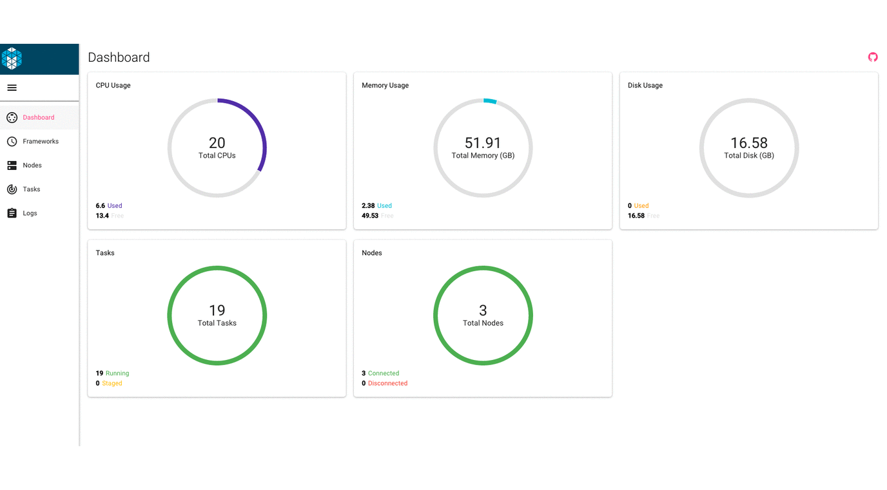

# Mesos UI

[](https://gitter.im/Capgemini/mesos-ui?utm_source=badge&utm_medium=badge&utm_campaign=pr-badge&utm_content=badge)

[](https://app.wercker.com/project/bykey/3e566621ba967bfeb6ee57a76ddf42cc)
[](https://codeclimate.com/repos/5613e8d3e30ba0426b004fdb/feed)
[](https://codeclimate.com/repos/5613e8d3e30ba0426b004fdb/coverage)

A responsive, realtime dashboard for Apache Mesos built using Node.js, React.js.



## Usage

The quickest way to check it out is just run:

``` docker run --net=host -e MESOS_LOG_DIR=/logs capgemini/mesos-ui:latest ```

And you should be able to access to 127.0.0.1:5050 via browser.

### Replacing the Mesos default UI

#### With Docker

You can use [capgemini/mesos-ui](https://hub.docker.com/r/capgemini/mesos-ui/) for running a container extending [mesosphere/mesos-master](https://hub.docker.com/r/mesosphere/mesos-master/) with this mesos-ui as the default Mesos UI.

##### Building the Docker image

```
git clone https://github.com/Capgemini/mesos-ui.git mesos-ui
cd mesos-ui
npm install

export MESOS_VERSION="Mesos version to build from"
//This must be an existing local git tag.
export MESOS_UI_VERSION="Mesos ui version"

make
```

#### Without Docker

```
git clone https://github.com/Capgemini/mesos-ui.git mesos-ui
cd mesos-ui
npm install
gulp build
```

Run mesos like:

```./bin/mesos-master.sh --ip=127.0.0.1 --work_dir=/var/lib/mesos --log_dir=/var/lib/mesos/logs --webui_dir=/path-to/mesos-ui/build/```

or using environment variables:

```export MESOS_WEBUI_DIR=/your-path/mesos-ui/build/```

See http://mesos.apache.org/gettingstarted/

See http://mesos.apache.org/documentation/latest/configuration/

## Compatibility

This code has been tested against Mesos version 0.23 at the time of writing.

## Developing locally

### Prerequisites

NodeJS (+ NPM) version 4.x. See [https://nodejs.org/en/download/releases/](https://nodejs.org/en/download/releases/) for installation instructions.

Install gulp package for global use:

```
sudo npm install -g gulp
```

To run the app, first clone the repo:

```
git clone https://github.com/Capgemini/mesos-ui.git mesos-ui
```

Install the NPM packages:

```
cd mesos-ui
npm install
```
Make sure you change the config file to point to the stub server.
```cd src/config```
```'mesosEndpoint': 'http://127.0.0.1:8000'``` 

Serve the app

```
gulp
```

At this point the app should open in the browser the page `http://localhost:3000`.

The application is using a stub JSON server to mock the Mesos APIs
so you don't necessarily need a working Mesos Cluster. For that we are using
[json-server](https://github.com/typicode/json-server).

The application should be available on http://localhost:5000.

The stub data is at [src/stub.json](https://github.com/Capgemini/mesos-ui/blob/master/src/stub.json). The UI for json-server should be available on http://localhost:8000

For using the previews standalone version of mesos-ui [check this out](https://github.com/Capgemini/mesos-ui/tree/0.1.0)


